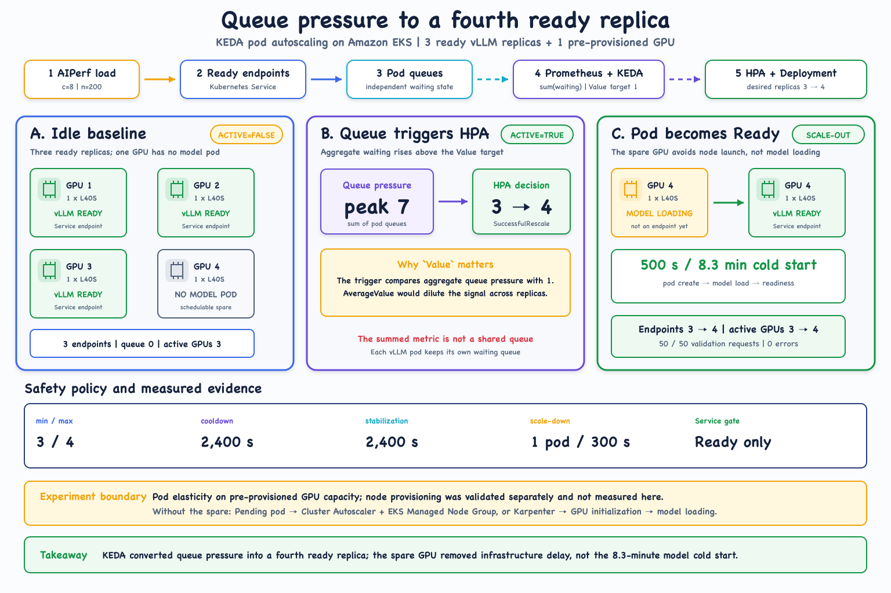

# KEDA Queue-Based Autoscaling

## Question

Can aggregate vLLM queue pressure safely scale a deployment from three ready
replicas to four when the fourth GPU is already provisioned?

## Visual Story



Regenerate the SVG and PNG with:

```bash
node experiments/01-keda-autoscaling/build_keda_scaleout_diagram.mjs
```

## Reference Flow

```text
3 ready replicas + 1 schedulable GPU
  -> sustained AIPerf load
  -> sum(vllm:num_requests_waiting) exceeds 1
  -> KEDA external metric becomes active
  -> HPA changes desired replicas 3 -> 4
  -> fourth pod loads the model and becomes Ready
  -> traffic reaches all four replicas
```

## Policy

| Setting | Reference value |
|---|---:|
| Minimum replicas | 3 |
| Maximum replicas | 4 |
| Metric type | `Value` |
| Aggregate queue threshold | 1 |
| Cooldown period | 2400 seconds |
| Scale-down stabilization | 2400 seconds |
| Scale-down rate | 1 pod per 300 seconds |

`Value` is deliberate. The trigger compares total queue pressure with the
threshold; `AverageValue` would dilute the signal across replicas.

## Success Evidence

- ScaledObject `Ready=True` and becomes `Active=True` under load;
- the KEDA-created HPA reports the external metric with target `1`;
- HPA emits `SuccessfulRescale` with new size `4`;
- the fourth pod is created on the pre-provisioned GPU;
- the Service adds it only after readiness succeeds; and
- DCGM active-GPU count rises from three to four.

The queue need not fall to zero under sustained load. Adding a fourth
single-sequence worker increases service capacity; it does not guarantee that
concurrency immediately falls below aggregate capacity.

In the reference run, aggregate waiting requests peaked at `7`, the HPA changed
desired replicas from `3` to `4`, and the new pod became Ready after `500`
seconds. A follow-up validation completed `50/50` requests without API errors
and reached all four GPUs.

## Boundary

This experiment intentionally held node capacity constant to isolate the
KEDA/HPA replica-scaling loop. The fourth GPU was pre-provisioned and
schedulable; node-capacity scaling had been validated separately and was not
measured here. In production, additional capacity could be supplied by Cluster
Autoscaler with an EKS Managed Node Group or by Karpenter. A Managed Node Group
does not initiate autoscaling by itself.

Without the spare GPU, the fourth pod would remain Pending while the node
provisioning loop runs. End-to-end scale-to-ready would then include node
launch, GPU initialization, model loading, graph capture, and readiness. This
experiment measured the latter application path and observed a `500`-second
model cold start. That long cold start is why scale-down is intentionally slow.
Pin replicas or pause KEDA during fixed-capacity performance comparisons.

Review and parameterize [`manifests/scaledobject.yaml`](./manifests/scaledobject.yaml)
before applying it.
