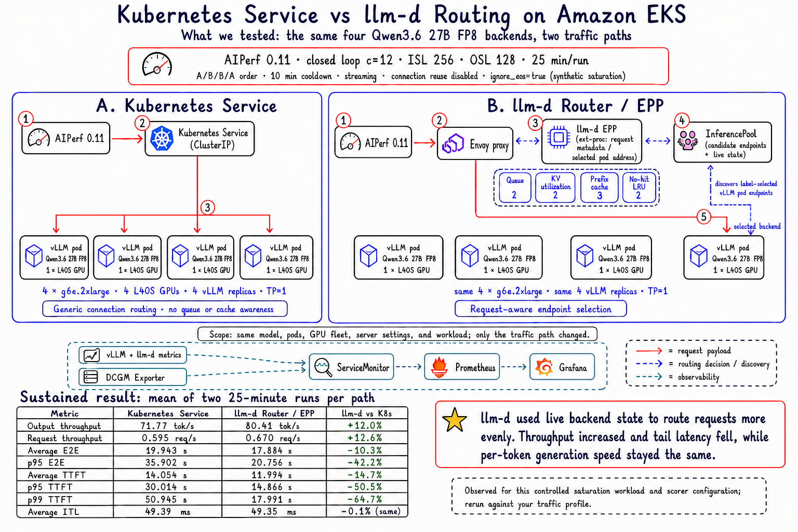

# Kubernetes Service vs llm-d Routing on Amazon EKS



## What We Tested

This experiment compared two entry paths to the same homogeneous inference
fleet:

```text
Path A: AIPerf -> Kubernetes Service -> four vLLM pods
Path B: AIPerf -> Envoy + llm-d EPP -> the same four vLLM pods
```

| Control | Value |
| --- | --- |
| Model | Qwen3.6 27B FP8 |
| GPU fleet | 4 x `g6e.2xlarge`, one NVIDIA L40S per node |
| Serving shape | 4 vLLM replicas, TP=1, one GPU per replica |
| Scheduling capacity | `max-num-seqs=1` per replica |
| AIPerf | 0.11.0, in-cluster runner |
| Workload | Closed loop, concurrency 12, ISL 256, OSL 128 |
| Run duration | 25 minutes plus a 30-second completion grace |
| Repetitions | Two runs per path in A/B/B/A order |
| Between-run control | 10-minute cooldown; queue at zero and all endpoints ready |
| Streaming | Enabled |
| Client connection reuse | Disabled |
| Output behavior | `ignore_eos=true` for synthetic saturation |

The model, vLLM pods, GPU nodes, server settings, benchmark process, and
observability stack remained unchanged. Only the traffic path changed.

## How The Paths Differ

The Kubernetes Service path provides generic connection-level balancing
across ready pod endpoints. It does not understand vLLM queue depth,
KV-cache pressure, or prefix-cache affinity.

The llm-d path uses Envoy for the request payload and EPP for endpoint
selection:

1. Envoy sends request metadata to EPP through `ext-proc`.
2. EPP discovers candidate pods through the InferencePool.
3. EPP scores those candidates and returns the selected pod address.
4. Envoy sends the request payload directly to that vLLM pod.

The InferencePool is the label-based grouping and discovery API. Neither EPP
nor the InferencePool is an extra request-payload hop.

The benchmark used these scorer weights:

| Scorer | Weight | Routing intent |
| --- | ---: | --- |
| Queue | 2 | Prefer a backend with less queued work |
| KV-cache utilization | 2 | Avoid concentrating requests on fuller caches |
| Prefix cache | 3 | Prefer a backend likely to reuse an existing prefix |
| No-hit LRU | 2 | Spread work when no useful prefix match exists |

## Sustained Comparison

The values below are the mean of the two 25-minute runs for each path.

| Metric | Kubernetes Service | llm-d Router / EPP | llm-d vs K8s |
| --- | ---: | ---: | ---: |
| Output throughput | 71.77 tok/s | 80.41 tok/s | +12.0% |
| Request throughput | 0.595 req/s | 0.670 req/s | +12.6% |
| Requests completed | 908.5 | 1,012 | +11.4% |
| Average E2E latency | 19.943 s | 17.884 s | -10.3% |
| p95 E2E latency | 35.902 s | 20.756 s | -42.2% |
| Average TTFT | 14.054 s | 11.994 s | -14.7% |
| p95 TTFT | 30.014 s | 14.866 s | -50.5% |
| p99 TTFT | 50.945 s | 17.991 s | -64.7% |
| Average ITL | 49.39 ms | 49.35 ms | -0.1% |

Higher is better for throughput and completed requests. Lower is better for
latency.

## Interpretation

llm-d used live backend state to route requests more evenly. Throughput
increased and tail latency fell, while per-token generation speed stayed the
same. The clearest improvement was TTFT: p95 fell by 50.5% and p99 fell by
64.7%.

Average ITL was effectively unchanged. Routing helped a request reach a
less-congested backend, but it did not make the selected GPU decode each
subsequent token faster.

The per-pod and DCGM metrics supported the same explanation. Kubernetes
Service routing showed temporary queue and GPU-duty-cycle imbalance. llm-d
kept work more evenly distributed by considering live backend state when
placing new requests.

## Experiment Boundary

This is a routing comparison, not a universal llm-d performance claim.
`ignore_eos=true`, fixed output targets, disabled connection reuse,
`max-num-seqs=1`, and concurrency 12 intentionally created sustained queue
pressure. Real traffic with variable prompts, output lengths, arrival
patterns, and connection behavior will produce different absolute results.

The A/B/B/A order reduced ordering bias, but the cooldown did not guarantee
complete KV- or prefix-cache eviction. Production adoption should repeat the
same comparison with representative prompts, concurrency, arrival rate,
streaming behavior, and scorer weights.

Raw AIPerf logs and request data are intentionally excluded from this public
repository. The complete sanitized metric table and experiment boundary are
preserved above.

## Reproduction Files

- [smoke-sized Router/EPP values](./manifests/router-values-smoke.yaml)
- [benchmark-sized Router/EPP values](./manifests/router-values-benchmark.yaml)
- [Kubernetes Service AIPerf workload](./manifests/aiperf-kubernetes-service.yaml)
- [llm-d AIPerf workload](./manifests/aiperf-llm-d.yaml)

Install the Gateway API Inference Extension and the matching llm-d chart/CRDs
before applying these version-specific examples.
