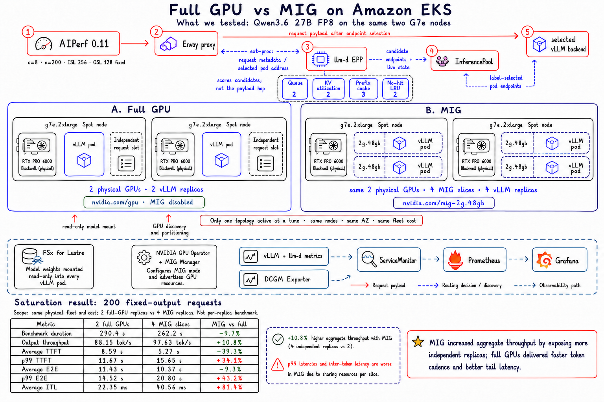

# Full GPU vs MIG on Amazon EKS

## What We Tested

The experiment reconfigured the same two `g7e.2xlarge` Spot nodes in
`us-east-2a` between two serving topologies:

| Topology | Physical GPUs | Kubernetes GPU resources | vLLM replicas |
| --- | ---: | --- | ---: |
| Full GPU | 2 x RTX PRO 6000 Blackwell | 2 x `nvidia.com/gpu` | 2 |
| MIG | Same 2 physical GPUs | 4 x `nvidia.com/mig-2g.48gb` | 4 |

> **Experiment boundary:** A curiosity-driven topology comparison, not a
> per-replica GPU benchmark. Physical fleet and cost were held constant;
> replica count changed intentionally from two full-GPU workers to four MIG
> workers.

Both phases used Qwen3.6 27B FP8, vLLM 0.24.0, tensor parallel size 1,
`max-num-seqs=1`, the same llm-d Router/EPP, and the same AIPerf workload.
Only one model Deployment was active at a time.

The shared architecture included:

- an in-cluster AIPerf 0.11 runner;
- Envoy, llm-d EPP, and an InferencePool;
- queue, KV-cache utilization, prefix-cache, and no-hit LRU scorers;
- FSx for Lustre for the read-only model mount;
- NVIDIA GPU Operator, MIG Manager, and the device plugin;
- vLLM and llm-d application metrics;
- DCGM Exporter hardware telemetry; and
- ServiceMonitor, Prometheus, and Grafana.

Envoy carried the request payload. It called EPP through `ext-proc`; EPP
scored candidate pods from the InferencePool and returned the selected pod
address. Envoy then forwarded the request directly to that vLLM backend.
InferencePool was the label-based grouping and discovery API, not another
payload proxy.

## Saturation Comparison

Each phase processed 200 streaming requests at concurrency 8. Input length
was 256 tokens and every response produced exactly 128 output tokens.
Thinking was disabled, EOS was ignored to equalize output work, and client
connection reuse was disabled.

| Metric | 2 full GPUs | 4 MIG slices | MIG vs full |
| --- | ---: | ---: | ---: |
| Benchmark duration | 290.41 s | 262.22 s | -9.7% |
| Request throughput | 0.689 req/s | 0.763 req/s | +10.8% |
| Output throughput | 88.15 tok/s | 97.63 tok/s | +10.8% |
| TTFT average | 8,590 ms | 5,218 ms | -39.3% |
| TTFT p50 | 8,761 ms | 5,271 ms | -39.8% |
| TTFT p90 | 11,576 ms | 10,406 ms | -10.1% |
| TTFT p99 | 11,665 ms | 15,648 ms | +34.1% |
| E2E average | 11,429 ms | 10,369 ms | -9.3% |
| E2E p50 | 11,608 ms | 10,422 ms | -10.2% |
| E2E p90 | 14,421 ms | 15,550 ms | +7.8% |
| E2E p99 | 14,519 ms | 20,797 ms | +43.2% |
| ITL average | 22.35 ms | 40.56 ms | +81.4% |
| ITL p50 | 22.42 ms | 40.57 ms | +80.9% |
| ITL p99 | 22.54 ms | 40.80 ms | +81.0% |
| Time to second token average | 22.51 ms | 40.78 ms | +81.2% |

Lower is better for duration and latency. Higher is better for throughput.

## Interpretation

MIG did not make an individual request decode faster. It exposed four
independent vLLM replicas instead of two. With `max-num-seqs=1`, that doubled
the number of simultaneous admission slots. At concurrency 8, the extra
parallelism produced 10.8% more aggregate output tokens per second at the
same physical-node cost.

The tradeoff appears in token cadence and tail latency. Full GPUs delivered
about 45% lower average ITL and materially better p99 TTFT and p99 E2E
latency. MIG improved average and median time to first token, but its smaller
GPU partitions made each individual decode stream slower.

At an unchanged fleet price, the 10.8% throughput increase corresponds to
about 9.7% lower cost per fixed-output request or per one million output
tokens. This is a relative comparison; no on-demand price was assigned to the
Spot run.

This is one controlled run per topology, not a universal MIG performance
claim. A production decision should repeat the matrix and sweep
`max-num-seqs`, concurrency, input length, and output length.

The detailed sanitized record is in [`RESULTS.md`](./RESULTS.md). Raw AIPerf
logs, prompts, and cluster snapshots are intentionally excluded.

## Reproduction Files

- [full-GPU Deployment](./manifests/full-gpu.yaml)
- [MIG `2g.48gb` Deployment](./manifests/mig-2g-48gb.yaml)
- [AIPerf workload matrix](./run-aiperf-matrix.sh)

Only one serving topology should be active at a time. MIG profile names and
resource labels are GPU-model and driver dependent; verify them on the target
node before applying the MIG manifest.
