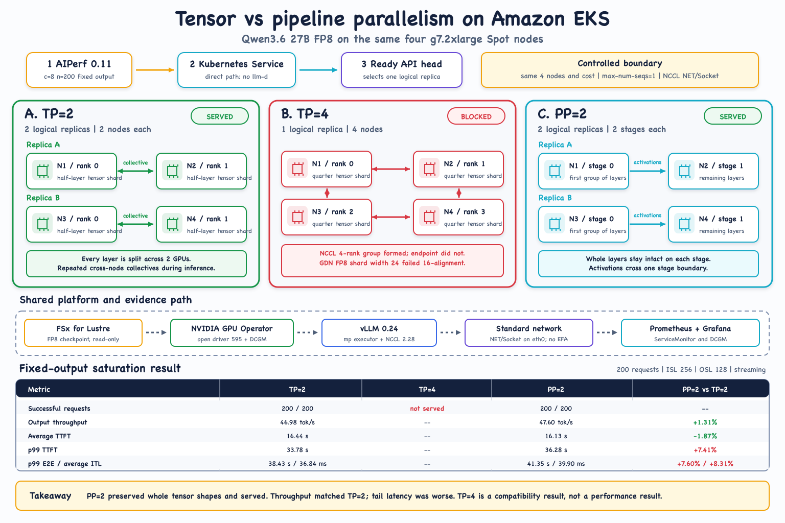

# Qwen3.6 27B Inter-node Parallelism on Amazon EKS

## What we tested

We used the same four `g7.2xlarge` Spot nodes, with one 32 GiB NVIDIA RTX PRO 4500 Blackwell GPU per node, to explore three ways of placing Qwen3.6 27B FP8 across nodes:

| Topology | Logical replicas | Nodes per replica | Outcome |
|---|---:|---:|---|
| TP=2 | 2 | 2 | Served |
| TP=4 | 1 | 4 | Blocked during FP8 model initialization |
| PP=2 | 2 | 2 | Served |

The request path used a direct Kubernetes Service. The runtime was vLLM 0.24.0 with NCCL over standard `NET/Socket` networking on `eth0`; EFA was not available on this instance size.

## Controlled saturation result

Both serving topologies used 200 requests, concurrency 8, ISL 256, OSL 128, streaming, fixed output, and `max-num-seqs=1`.

| Metric | TP=2 | PP=2 | PP=2 vs TP=2 |
|---|---:|---:|---:|
| Successful requests | 200 / 200 | 200 / 200 | -- |
| Output throughput | 46.98 tok/s | 47.60 tok/s | +1.31% |
| Request throughput | 0.367 req/s | 0.372 req/s | +1.31% |
| Average TTFT | 16.44 s | 16.13 s | -1.87% |
| p99 TTFT | 33.78 s | 36.28 s | +7.41% |
| p99 E2E | 38.43 s | 41.35 s | +7.60% |
| Average ITL | 36.84 ms | 39.90 ms | +8.31% |

## What the result means

TP=2 and PP=2 reached near aggregate-throughput parity. PP=2 preserved whole tensor shapes and therefore served successfully, but it did not improve tail latency in this controlled run.

TP=4 is a compatibility result, not a performance result. Its four-rank NCCL group formed successfully, but the model endpoint never became ready. Splitting the affected GatedDeltaNet FP8 projection four ways produced a per-rank width of 24, which did not satisfy the available kernel's 16-element alignment requirement. No TP=4 requests were served, so reporting a TP=4 latency or throughput percentage would be misleading.

## Experiment boundary

This was a topology experiment over ordinary inter-node socket networking, not an ideal production TP benchmark. The PP=2 arm retained `max-num-seqs=1`; it is a controlled comparison, not a pipeline-filled capacity ceiling. A production-quality follow-up should use EFA-capable instances and separately sweep PP concurrency and `max-num-seqs`.

## Supporting material

- Full measurements and interpretation: [RESULTS.md](RESULTS.md)
- Shared launcher settings: [manifests/common.yaml](manifests/common.yaml)
- PP=2 manifest: [manifests/pp2.yaml](manifests/pp2.yaml)
- TP=2 manifest: [manifests/tp2.yaml](manifests/tp2.yaml)
- TP=4 manifest: [manifests/tp4.yaml](manifests/tp4.yaml)
- AIPerf matrix: [run-aiperf-matrix.sh](run-aiperf-matrix.sh)
- Diagram source: [build_parallelism_diagram.mjs](build_parallelism_diagram.mjs)
