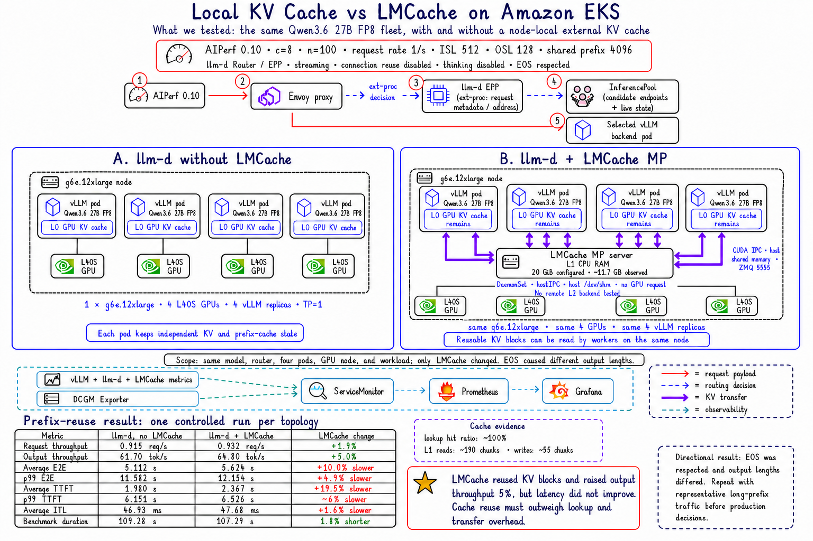

# Local KV Cache vs LMCache on Amazon EKS



## What We Tested

This experiment added LMCache to an otherwise unchanged homogeneous llm-d
serving fleet:

```text
Path A: AIPerf -> llm-d Router/EPP -> four vLLM pods
Path B: AIPerf -> llm-d Router/EPP -> the same four vLLM pods + LMCache MP
```

| Control | Value |
| --- | --- |
| Model | Qwen3.6 27B FP8 |
| GPU fleet | 1 x `g6e.12xlarge`, 4 x NVIDIA L40S |
| Serving shape | 4 vLLM replicas, TP=1, one GPU per replica |
| Router | Same llm-d Router/EPP and InferencePool |
| AIPerf | 0.10.0, in-cluster runner |
| Workload | Concurrency 8, 100 requests, request rate 1/s |
| Prompt shape | ISL 512, OSL 128, one shared 4,096-token prefix |
| Streaming | Enabled |
| Client connection reuse | Disabled |
| Thinking | Disabled per request |
| EOS | Respected |

The model, vLLM runtime, router, four serving pods, GPU node, and benchmark
shape remained unchanged. Only LMCache was added.

## LMCache Topology

Every vLLM worker retained its normal L0 GPU KV cache. LMCache added one
node-local L1 cache service backed by CPU memory; it did not move all KV state
out of GPU memory.

The working LMCache MP topology used:

```text
LMCache server:
  DaemonSet, one pod per GPU node
  CPU-only; no GPU request
  hostNetwork and hostIPC
  host /dev/shm
  ZMQ port 5555
  20 GiB configured L1 capacity

vLLM workers:
  four replicas
  hostIPC and host /dev/shm
  one GPU per pod
  LMCacheMPConnector
  connect through the node IP
```

CUDA IPC and host shared memory require the vLLM workers and their LMCache MP
server to be node-local. A normal ClusterIP service with isolated pod
`/dev/shm` was not sufficient for this transfer path.

No remote L2 backend such as Valkey, object storage, or a distributed cache
was included in this experiment.

## Prefix-Reuse Comparison

This was one controlled run per topology.

| Metric | llm-d, no LMCache | llm-d + LMCache | LMCache change |
| --- | ---: | ---: | ---: |
| Request throughput | 0.915 req/s | 0.932 req/s | +1.9% |
| Output throughput | 61.70 tok/s | 64.80 tok/s | +5.0% |
| Total output tokens | 6,743 | 6,952 | +3.1% |
| Average E2E latency | 5.112 s | 5.624 s | 10.0% slower |
| p50 E2E latency | 5.649 s | 6.272 s | 11.0% slower |
| p90 E2E latency | 9.837 s | 10.573 s | 7.5% slower |
| p99 E2E latency | 11.582 s | 12.154 s | 4.9% slower |
| Average TTFT | 1.980 s | 2.367 s | 19.5% slower |
| p50 TTFT | 0.838 s | 1.748 s | 108.7% slower |
| p90 TTFT | 5.418 s | 5.621 s | 3.7% slower |
| p99 TTFT | 6.151 s | 6.526 s | 6.1% slower |
| Average ITL | 46.93 ms | 47.68 ms | 1.6% slower |
| Benchmark duration | 109.28 s | 107.29 s | 1.8% shorter |

Higher is better for throughput. Lower is better for latency and duration.

## Cache Evidence

Prometheus confirmed that the external cache path was exercised:

| Signal | Observed value |
| --- | ---: |
| Lookup-requested tokens | Approximately 298,599 |
| Lookup-hit tokens | Approximately 298,597 |
| L1 reads | Approximately 190 chunks |
| L1 writes | Approximately 55 chunks |
| L1 memory usage | Approximately 11.7 GB |
| L1 usage ratio | Approximately 0.55 |

All four LMCache-backed vLLM pods received requests, and all four GPUs reached
100% maximum utilization during the run.

## Interpretation

LMCache reused KV blocks and increased output throughput by 5.0%, but latency
did not improve. The cache lookup and transfer path added enough overhead to
offset the prefill work avoided by cache reuse for this workload.

This does not mean LMCache lacks value. It means the benefit depends on the
amount and cost of reusable context. LMCache deserves deeper evaluation for
long repeated system prompts, shared RAG context, multi-turn sessions,
replica churn, and other cases where reconstructing KV state is more expensive
than retrieving it.

## Experiment Boundary

This is an early directional result, not a universal LMCache performance
claim. EOS was respected, and 61 of the 100 LMCache requests ended before the
requested OSL of 128. The two runs therefore performed different amounts of
output-token work.

Repeat the comparison with controlled output lengths and representative
long-prefix traffic before making production or cost decisions. Do not claim
a fixed per-GPU VRAM saving from this run: DCGM reports aggregate framebuffer
usage and does not separate model weights from KV-cache allocation.

Raw AIPerf exports, prompts, and model output are intentionally excluded from
this public repository. The sanitized measurements and cache evidence required
to interpret the result are preserved above.

## Reproduction Files

- [no-LMCache baseline](./manifests/baseline.yaml)
- [LMCache MP topology](./manifests/lmcache-mp.yaml)
- [serving image example](./Dockerfile)

Replace image and model placeholders, and validate connector compatibility with
the exact vLLM and LMCache versions before deployment.
