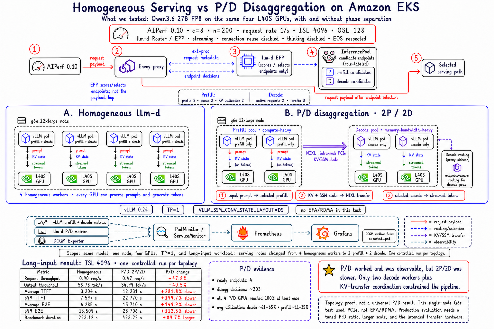

# Homogeneous Serving vs P/D Disaggregation on Amazon EKS



## What We Tested

This experiment compared two serving topologies behind llm-d:

```text
Path A: AIPerf -> llm-d Router/EPP -> four homogeneous vLLM workers
Path B: AIPerf -> llm-d P/D Router/EPP
        -> two prefill workers
        -> NIXL KV/state transfer
        -> two decode workers
```

| Control | Value |
| --- | --- |
| Model | Qwen3.6 27B FP8 |
| GPU fleet | 1 x `g6e.12xlarge`, 4 x NVIDIA L40S |
| Baseline shape | 4 homogeneous vLLM replicas, TP=1 |
| P/D shape | 2 prefill replicas + 2 decode replicas, TP=1 |
| Runtime | vLLM 0.24 |
| Transfer | NIXL, intra-node PCIe path |
| Router | llm-d Router/EPP and InferencePool |
| AIPerf | 0.10.0, in-cluster runner |
| Workload | Concurrency 8, 200 requests, request rate 1/s |
| Prompt shape | ISL 4,096, OSL 128 |
| Streaming | Enabled |
| Client connection reuse | Disabled |
| Thinking | Disabled per request |
| EOS | Respected |

The physical node, four GPUs, model, TP setting, router family, and benchmark
shape were held constant. The serving topology changed intentionally from four
workers that could perform both phases to two dedicated prefill workers and two
dedicated decode workers.

## P/D Request Flow

The P/D EPP used separate scheduling profiles for the two phases:

```text
Prefill selection:
  prefill role filter
  prefix-cache scorer, weight 3
  queue scorer, weight 2
  KV-cache-utilization scorer, weight 2

Decode selection:
  decode role filter
  active-request scorer, weight 2
  prefix-cache scorer, weight 3
```

For each disaggregated request, EPP selected both endpoints before the model
work began:

1. Envoy sent request metadata to EPP. The decode scheduling profile selected
   the primary decode endpoint, while the prefill profile selected a prefill
   endpoint.
2. EPP returned the decode endpoint as the primary destination and injected
   the selected prefill address into a routing header.
3. Envoy forwarded the original request to the routing-proxy sidecar inside
   the selected decode pod.
4. The sidecar read the prefill address and sent the prompt to that remote
   prefill worker.
5. The prefill worker tokenized the prompt, processed all 4,096 input tokens,
   and produced the request-specific attention KV cache and Qwen3.6 SSM state.
   Model weights remained resident in each model-server pod and were not
   transferred.
6. The prefill response returned transfer metadata to the sidecar. The large
   KV/SSM payload did not flow through the sidecar.
7. The sidecar enriched the original request with the transfer metadata and
   forwarded it to its co-located vLLM decoder.
8. The selected decoder pulled the KV/SSM state directly from the prefill
   worker through NIXL, continued from the completed prompt state, and
   generated and streamed the output tokens.

```text
Client
  -> Envoy / EPP selects Prefill P2 and Decode D1
  -> Decode D1 routing-proxy sidecar
       -> sends prompt to remote Prefill P2
       <- receives KV/SSM transfer metadata
       -> forwards enriched request to local vLLM Decode D1

Prefill P2 KV/SSM state
  -> NIXL data transfer
  -> Decode D1
  -> streamed output tokens
```

The routing proxy was a CPU-only sidecar container in every decode pod, not a
shared routing pod. In this manifest it listened on port `8000` and forwarded
decode work to the co-located vLLM container on port `8200`. It coordinated a
remote prefill plus a local decode; it did not delegate the request to another
decode pod. EPP had already made the decode-selection decision.

This separation is useful when explaining the two paths:

- **Control path:** Envoy, EPP, routing headers, sidecar RPCs, and transfer
  metadata.
- **Data path:** request-specific KV/SSM state transferred directly from the
  selected prefill worker to the selected decoder through NIXL.

See the
[llm-d disaggregated-serving architecture](https://llm-d.ai/docs/architecture/advanced/disaggregation)
for the general request-orchestration design.

The Qwen3.6 hybrid-state path required:

```text
VLLM_SSM_CONV_STATE_LAYOUT=DS
--block-size 128
--no-disable-hybrid-kv-cache-manager
--kv-transfer-config '{"kv_connector":"NixlConnector","kv_role":"kv_both","kv_load_failure_policy":"fail"}'
```

The first attempt failed without the DS convolution-state layout. After adding
it, a 1P/1D smoke completed 5 of 5 requests with no API errors before the
topology was expanded to 2P/2D.

## Long-Input Comparison

The table below is the main P/D result. It used `ISL=4096` so prefill pressure
was visible rather than relying only on a short-prompt continuity workload.

| Metric | Homogeneous llm-d | P/D 2P/2D | P/D change |
| --- | ---: | ---: | ---: |
| Requests | 200 | 200 | Equal |
| API errors | 0 | 0 | Equal |
| Request throughput | 0.90 req/s | 0.47 req/s | 47.8% lower |
| Output throughput | 58.78 tok/s | 34.99 tok/s | 40.5% lower |
| Average TTFT | 3.204 s | 12.231 s | 281.8% slower |
| p50 TTFT | 2.241 s | 12.124 s | 441.1% slower |
| p90 TTFT | 6.677 s | 18.932 s | 183.5% slower |
| p99 TTFT | 7.597 s | 22.770 s | 199.7% slower |
| Average E2E latency | 6.285 s | 15.710 s | 149.9% slower |
| p50 E2E latency | 6.782 s | 16.430 s | 142.3% slower |
| p90 E2E latency | 10.620 s | 23.033 s | 116.9% slower |
| p99 E2E latency | 13.509 s | 28.706 s | 112.5% slower |
| Average output length | 65.58 tokens | 74.05 tokens | 12.9% higher |
| Benchmark duration | 223.12 s | 423.22 s | 89.7% longer |

Higher is better for throughput. Lower is better for latency and duration.

## Observability Evidence

The topology and metrics path worked end to end:

| Signal | Observed value |
| --- | ---: |
| P/D EPP ready endpoints | 4 |
| P/D disaggregation decisions | Approximately 203 |
| Prefill vLLM scrape targets | 2 |
| Decode vLLM scrape targets | 2 |
| P/D GPUs reaching 100% utilization | 4 of 4 |
| Average decode-GPU utilization | Approximately 61% and 65% |
| Average prefill-GPU utilization | Approximately 11% and 35% |

Separate PodMonitors scraped the prefill and decode model servers. The llm-d
router metrics and DCGM GPU telemetry were also available in Prometheus and
Grafana. For this topology, the DCGM workload name was carried in the
`exported_pod` label.

## Interpretation

P/D disaggregation was functional and fully observable, but it was not a
performance win on this topology.

The homogeneous baseline had four workers that could each perform prefill and
decode. The 2P/2D topology left only two decode workers and added state-transfer
coordination. Even with 4,096-token inputs, the reduced decode capacity and
transfer overhead outweighed the benefit of separating the phases.

All four P/D GPUs becoming busy did not mean the request pipeline was more
efficient. GPU activity must be interpreted together with throughput, TTFT,
tail latency, and the utilization split between prefill and decode roles.

## Experiment Boundary

This was a topology experiment, not a universal P/D benchmark:

- The test used one `g6e.12xlarge` and intra-node PCIe transfer.
- It did not use a multi-node EFA/RDMA transfer path.
- The 2P:2D ratio was intentionally simple, not proven optimal.
- The two runs had different average output lengths because EOS was respected.
- Each topology was measured once, so the results are directional.

Production P/D evaluation should tune the P:D ratio for the measured ISL/OSL
distribution and test at a scale where independent phase scaling matters.
Multi-node designs should also measure the intended high-bandwidth transfer
path, such as EFA with libfabric on AWS.

The correct takeaway is:

> We proved the P/D topology, NIXL state transfer, and end-to-end observability.
> Performance wins require the right workload, P:D ratio, scale, and transfer
> hardware.

## Supporting Files

- [P/D model-server and PodMonitor manifest](./manifests/prefill-decode.yaml)
- [P/D Router/EPP values](./manifests/router-values.yaml)

The manifest captures a functional experiment and must be reviewed against the
vLLM, model, KV connector, and transport versions available in your environment.
