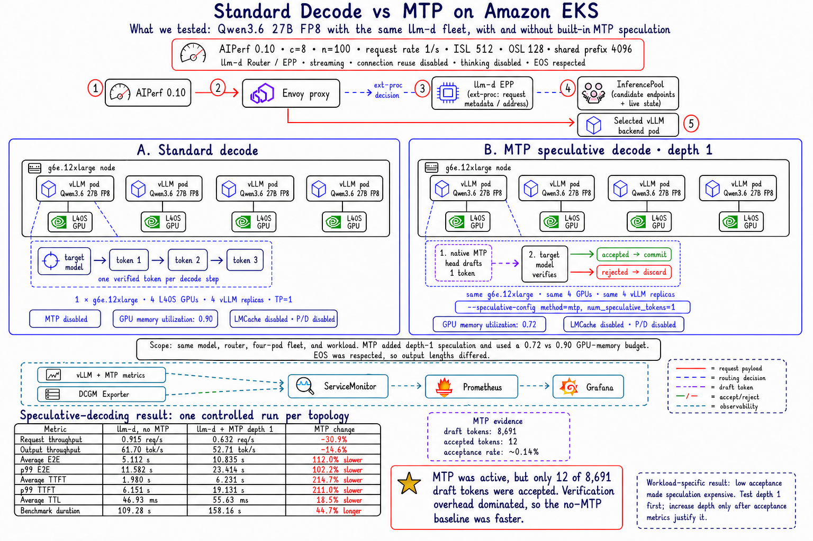

# Standard Decode vs MTP on Amazon EKS



## What We Tested

This experiment enabled Qwen3.6's built-in MTP speculative-decoding path in an
otherwise equivalent homogeneous llm-d serving fleet:

```text
Path A: AIPerf -> llm-d Router/EPP -> four standard vLLM workers
Path B: AIPerf -> llm-d Router/EPP -> four MTP-enabled vLLM workers
```

| Control | Value |
| --- | --- |
| Model | Qwen3.6 27B FP8 |
| GPU fleet | 1 x `g6e.12xlarge`, 4 x NVIDIA L40S |
| Serving shape | 4 vLLM replicas, TP=1, one GPU per replica |
| Router | Same llm-d Router/EPP and InferencePool |
| AIPerf | 0.10.0, in-cluster runner |
| Workload | Concurrency 8, 100 requests, request rate 1/s |
| Prompt shape | ISL 512, OSL 128, one shared 4,096-token prefix |
| Streaming | Enabled |
| Client connection reuse | Disabled |
| Thinking | Disabled per request |
| EOS | Respected |
| LMCache | Disabled |
| P/D disaggregation | Disabled |

The benchmark used the same model, router, four-replica fleet, GPU node, and
AIPerf workload. The MTP configuration introduced two meaningful serving
changes:

```text
speculative method:       mtp
num_speculative_tokens:   1
GPU memory utilization:   0.72 instead of the baseline 0.90
```

The lower memory budget made room for the MTP path and must remain part of the
experiment boundary.

## How MTP Works

Standard autoregressive decoding verifies and commits one token per decode
step.

With native MTP enabled:

1. The model's MTP head drafts a possible future token.
2. The target model verifies that draft.
3. An accepted draft advances generation.
4. A rejected draft is discarded, while the verification work has still been
   performed.

This experiment did not place a separate draft model on another GPU. vLLM
recognized the model's native MTP path and shared the target model's embedding
and language-head weights with it.

The tested configuration was:

```text
--speculative-config '{"method":"mtp","num_speculative_tokens":1}'
```

Depth 1 was intentionally tested before trying depths 3 or 5. Increasing the
depth when acceptance is poor would generate still more rejected work.

## Speculative-Decoding Comparison

This was one controlled run per topology.

| Metric | llm-d, no MTP | llm-d + MTP depth 1 | MTP change |
| --- | ---: | ---: | ---: |
| Request throughput | 0.915 req/s | 0.632 req/s | -30.9% |
| Output throughput | 61.70 tok/s | 52.71 tok/s | -14.6% |
| Total output tokens | 6,743 | 8,337 | +23.6% |
| Average E2E latency | 5.112 s | 10.835 s | 112.0% slower |
| p50 E2E latency | 5.649 s | 10.628 s | 88.1% slower |
| p90 E2E latency | 9.837 s | 15.098 s | 53.5% slower |
| p99 E2E latency | 11.582 s | 23.414 s | 102.2% slower |
| Average TTFT | 1.980 s | 6.231 s | 214.7% slower |
| p50 TTFT | 0.838 s | 6.879 s | 721.4% slower |
| p90 TTFT | 5.418 s | 8.698 s | 60.5% slower |
| p99 TTFT | 6.151 s | 19.131 s | 211.0% slower |
| Average ITL | 46.93 ms | 55.63 ms | 18.5% slower |
| Benchmark duration | 109.28 s | 158.16 s | 44.7% longer |

Higher is better for throughput. Lower is better for latency and duration.

## MTP Evidence

vLLM's speculative-decoding metrics confirmed that MTP was active:

| Signal | Observed value |
| --- | ---: |
| Draft tokens generated | 8,691 |
| Draft tokens accepted | 12 |
| Acceptance rate | Approximately 0.14% |

The per-pod counters were:

| Worker | Draft tokens | Accepted tokens |
| --- | ---: | ---: |
| 1 | 2,292 | 0 |
| 2 | 2,235 | 5 |
| 3 | 2,107 | 4 |
| 4 | 2,057 | 3 |

## Interpretation

MTP was functional, but only 12 of 8,691 draft tokens were accepted. The
acceptance rate was effectively zero, so draft generation and target
verification added work without advancing generation often enough to recover
their cost.

For this workload, the no-MTP llm-d baseline was better on throughput, TTFT,
E2E latency, ITL, and total benchmark duration. This is a workload-fit result,
not evidence that MTP is generally slower.

MTP is more likely to help when the model's native draft head predicts the
serving workload accurately, acceptance remains high, and generation is
decode-heavy enough for accepted drafts to amortize verification overhead.

## Experiment Boundary

EOS was respected. Seventy-seven of the 100 MTP requests and 70 of the 100
baseline requests ended before the requested OSL of 128, so the runs performed
different amounts of output-token work. The MTP path also used a lower GPU
memory-utilization budget.

Test depth 1 first and monitor draft tokens, accepted tokens, acceptance rate,
request throughput, TTFT, ITL, and p99 E2E latency. Increase speculative depth
only when the measured acceptance rate shows that speculation is paying for
it.

Raw AIPerf exports, prompts, and model output are intentionally excluded from
this public repository. The sanitized measurements and speculative-token
counters required to interpret the result are preserved above.

## Reproduction File

The [depth-1 MTP manifest](./manifests/mtp-depth-1.yaml) preserves the tested
configuration. Compare it with the no-MTP baseline using the same model image,
replica count, request path, and workload.
