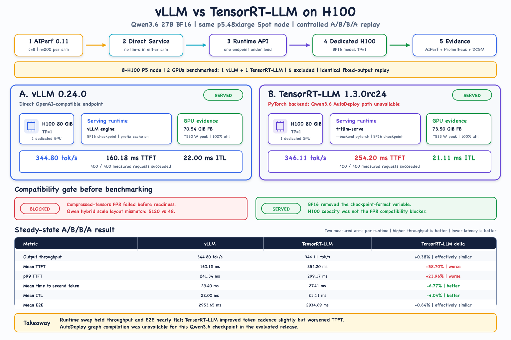

# vLLM vs TensorRT-LLM on H100

## What we tested

This experiment asked whether moving the existing Qwen3.6 27B workload to H100
removed the TensorRT-LLM compatibility boundary seen on G-series GPUs, and
whether a runtime change alone improved steady-state serving.

| Control | Value |
|---|---|
| Physical fleet | One Spot `p5.48xlarge` with 8 NVIDIA H100 GPUs, 80 GiB each |
| Benchmark GPU allocation | 2 of the 8 H100s: 1 dedicated to vLLM and 1 dedicated to TensorRT-LLM |
| Excluded capacity | The remaining 6 H100s were intentionally outside the benchmark |
| Model | Same Qwen3.6 27B BF16 checkpoint |
| Runtime A | vLLM 0.24.0 |
| Runtime B | TensorRT-LLM 1.3.0rc24, PyTorch backend |
| Serving shape | TP=1, one direct Kubernetes Service per runtime |
| AIPerf | 0.11.0, A/B/B/A, 200 measured requests per arm |
| Request shape | Concurrency 8, ISL 256, OSL 128, streaming, fixed output |
| Client behavior | Connection reuse disabled; thinking disabled |
| Prompt replay | Identical normalized inputs across all four arms |

Only one runtime received measured load at a time. Both runtime pods remained
resident on the same P5 node and had zero restarts.

## Compatibility gate

The existing compressed-tensors FP8 checkpoint did not initialize in
TensorRT-LLM 1.3.0rc24, even on H100. The failure was a Qwen hybrid-model FP8
scale-layout mismatch (`5120` versus `48`), not insufficient H100 memory.

The BF16 checkpoint removed that checkpoint-format variable and served
successfully. This matters when interpreting the benchmark: the comparison is
BF16 against BF16, not FP8 against FP8.

## Controlled result

The table reports the mean of two measured arms per runtime.

| Metric | vLLM | TensorRT-LLM | TensorRT-LLM relative to vLLM |
|---|---:|---:|---:|
| Output throughput | 344.80 tok/s | 346.11 tok/s | +0.38% |
| Request throughput | 2.694 req/s | 2.704 req/s | +0.38% |
| Mean TTFT | 160.18 ms | 254.20 ms | +58.70%, worse |
| p99 TTFT | 241.34 ms | 299.17 ms | +23.96%, worse |
| Mean time to second token | 29.40 ms | 27.41 ms | -6.77%, better |
| Mean ITL | 22.00 ms | 21.11 ms | -4.04%, better |
| Mean E2E | 2953.65 ms | 2934.69 ms | -0.64%, effectively similar |
| p99 E2E | 3007.50 ms | 2993.17 ms | -0.48%, effectively similar |
| Measured requests | 400 | 400 | All successful |

TensorRT-LLM slightly improved decode cadence, but throughput and end-to-end
latency were effectively unchanged and first-token latency was worse. This is a
mixed result, not evidence that either runtime is universally faster.

## Hardware observations

- Both runtime GPUs reached 100% utilization during measured arms.
- vLLM used about 70.54 GiB of framebuffer memory.
- TensorRT-LLM used about 73.50 GiB, roughly 2.96 GiB more.
- Observed peak power was similar: about 530 W for vLLM and 533 W for
  TensorRT-LLM.
- Both Prometheus targets remained up and no benchmark requests failed.

Observed pod start-to-ready time was 5m40s for TensorRT-LLM and 8m21s for vLLM.
This is diagnostic evidence only. Image and filesystem cache state were not
swapped or normalized, so startup time is not part of the controlled result.

## Experiment boundary

TensorRT-LLM ran through `trtllm-serve --backend pytorch`. This experiment
does not measure AutoDeploy graph compilation. In the evaluated TensorRT-LLM
release, AutoDeploy did not provide a supported path for this Qwen3.6 27B
checkpoint: Qwen3.6 had no validated dense registry entry, and the related
Qwen3.5 27B entry was disabled. This is a compatibility boundary, not an
omitted benchmark, and should be reevaluated as AutoDeploy model coverage
changes.

The planned cooldown was 60 seconds because Spot interruption risk was high.
AWS credentials expired after B2, so A2 resumed after an approximately
20-minute gap. Neither runtime restarted. The prompt replay remained identical,
but this recovery gap should stay attached to the result.

Unique synthetic prompts produced no meaningful prefix-cache reuse. Repeat the
experiment with representative prompts, output behavior, concurrency, and
runtime tuning before making a production choice.

## Supporting material

- Reproduction guide and exact runtime options: [CONFIGURATION.md](CONFIGURATION.md)
- Sanitized Kubernetes resources: [manifests](manifests)
- Smoke test, deterministic A/B/B/A runner, and result parser: [scripts](scripts)
- Full per-arm measurements and interpretation: [RESULTS.md](RESULTS.md)
- Diagram source: [build_runtime_comparison_diagram.mjs](build_runtime_comparison_diagram.mjs)

Raw prompts, model outputs, cluster identifiers, private image locations, and
AWS account details are intentionally excluded from this public repository.
